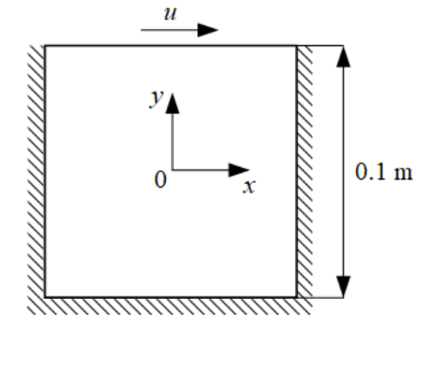

# Lid Driven Cavity Flow

The lid-driven cavity is a popular problem within the field of computational fluid dynamics (CFD) for validating computational methods. In this repository, we will walk through the process of generating a 2D flow simulation for the Lid Driven Cavity (LDC) flow using Nvidia Modulus framework.

## Problem Description

The lid-driven cavity is a well-known benchmark problem for viscous incompressible fluid flow [[75]](https://www.sciencedirect.com/book/9781856176354/the-finite-element-method-for-fluid-dynamics). The geometry at stake is shown in Figure 27. We are dealing with a square cavity consisting of three rigid walls with no-slip conditions and a lid moving with a tangential x-direction velocity of 1m/s. The [Reynolds number](https://en.wikipedia.org/wiki/Reynolds_number) based on the cavity height is chosen be 10.



## Modulus 
NVIDIA Modulus is a neural network framework that blends the power of physics and partial differential equations (PDEs) with AI to build more robust models for better analysis. This framework trains groundbreaking physics-ML models to turbocharge industrial digital twins, climate science, protein engineering and more. This supports:
- complex geometries
- various algebra equations
- specialize Physics Informed Neural Network Architecture
- parallel gpu computation
- CUDA/tensor core acceleration
- simulation visualization on Paraview

For details please check https://developer.nvidia.com/modulus

## Visualization
- Tensorboard : training records
- Nvidia Index Paraview: NVIDIA IndeX™ is integrated in ParaView—one of the most popular visualization tools in HPC. This means that users have access to IndeX features by default with the latest ParaView version, so they can experience real-time interactivity with their existing volume visualization workflows. 

For details please check https://www.nvidia.com/en-us/data-center/index-paraview-plugin/

## Installation of Modulus
Download Modulus Installation Guide and Container for Linux platform from https://developer.nvidia.com/modulus-downloads

### Modulus
Requirement: 
- Ubuntu 18.04 or Linux 4.18 kernel
- NVIDIA GPU based on the following architectures:
   - Nvidia Ampere GPU Architecture (A100)
   - Volta (V100, Titan V, Quadro GV100)
   - Turing (T4, Quadro RTX series)
   - Pascal (P100, P40, P4, Titan Xp, Titan X)
- Docker is recommended


### Paraview
- Windows 10
https://www.paraview.org/download/

## Procedure
1. - Geometry setup (Constructive Solid Geometry, CSG or STL)
   - Sampling on boundaries and interior regions
2. Equation setup (TrainDomain)
3. Solver setup (Solver)


## procedure
```
python ldc_2d.py --run_mode=plot_data
```     

 This should populate the files in thenetwork_checkpoint_ldc_2d/train_domain/data/directory. The different --run_mode available are:
 - solve: Default run mode. Trains the neural network.
 - plot_data:  Plots all the domains without training.  Useful for debugging BCs, ICs, visualizing domains,point-clouds, etc. before starting the training.
 - •eval: Evaluates all the domains using the last saved training checkpoint. Useful for post-processing whereadditional domains can be added after training is complete.